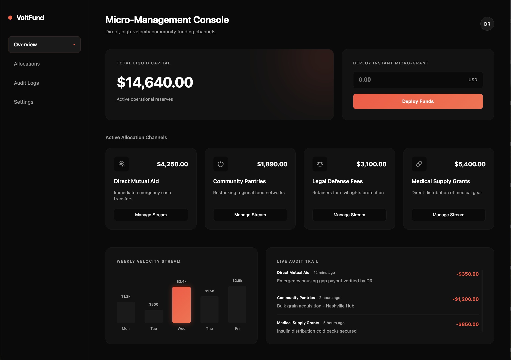
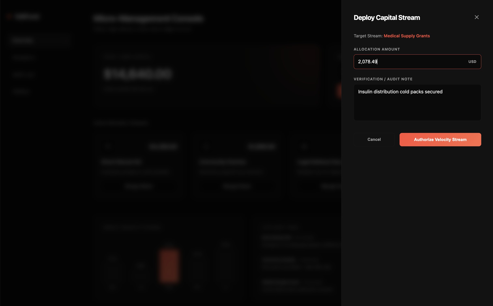
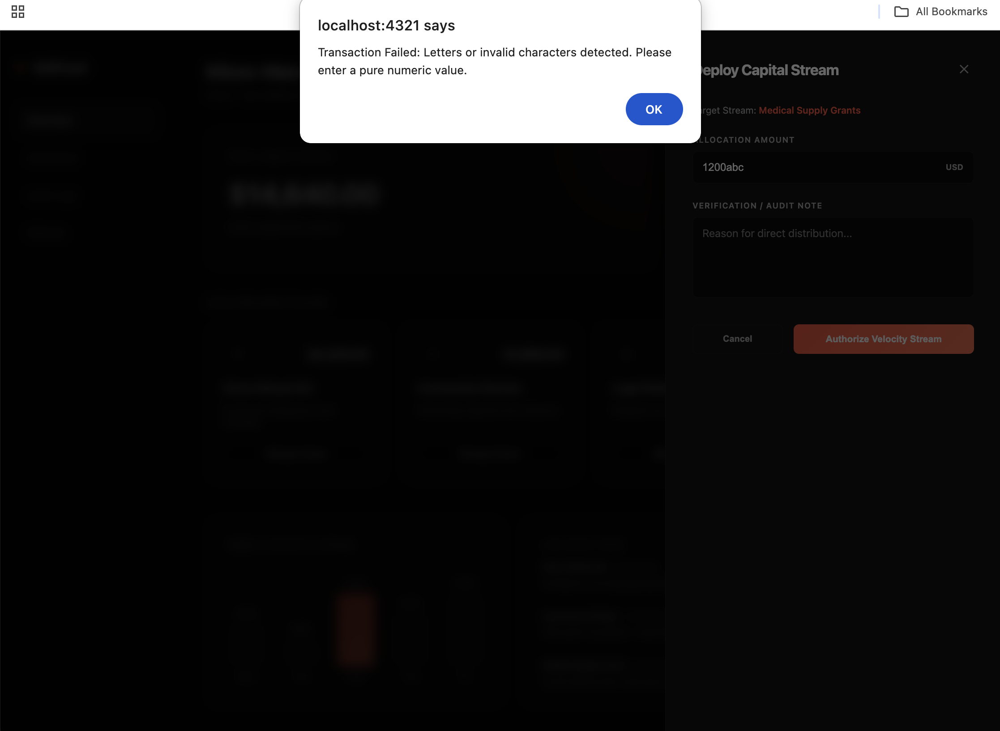

# VoltFund Console 
VoltFund is a real-time micro-grant dashboard for non-profit mutual aid distribution. It lets operators deploy emergency capital instantly into the community while tracking everything through a live audit ledger.

## Interface Preview

### Core Dashboard (Dark Mode View)


### Active Allocation Drawer Panel


### Form Math Validation Catch



## My Design Engineering Approach (UI/UX to Front-End)
Because of my design background, I don't just build components that look good—I design with empathy first to solve real human needs. When an operator is using an application to deploy emergency funds under pressure, the user interface needs to be lightning-fast, highly scannable, and completely clear.

### 1. Swiss-Industrial Minimalism
Color Psychology & Contrast: The entire UI uses a custom dark canvas theme (#0a0a0a) by default. This high-contrast setup minimizes eye strain during long management shifts and strips away unnecessary background noise, letting the data stand out.

Proportional Grid Layouts: I engineered strict whitespace and padding structures (32px on major card blocks). This industrial layout makes it incredibly easy for the human eye to scan the screen and find critical balances instantly.

Vibrant Accent Anchors: I use a sharp, neon-orange gradient theme (linear-gradient(135deg, #ff4e3a, #ff6b4a)) as a focal point. It highlights active data points, like the current day's column on the chart or negative ledger values, without breaking the minimalist aesthetic.

### 2. Tactile Micro-Interactions (Physical Momentum Theory)
Snappy Sidebar Navigation: Standard hover animations snap instantly or use boring linear transitions that feel completely mechanical. To make the dashboard feel premium, I wrote custom CSS transitions using a precise velocity curve: cubic-bezier(0.16, 1, 0.3, 1).

Tactile Feedback Loop: The exact millisecond your mouse skims across a sidebar tab, the link background smoothly blooms into view. At the same time, a tiny vector indicator dot scales up from 0 to 1 and slides out right next to the text. It gives the operator immediate, smooth feedback that the application is alive and highly responsive.

### 3. Dual-Environment Token System
Light & Dark Adaptation: While dark mode is great for indoor tracking, a high-contrast Light Mode is completely mandatory if an operator is out in the field under bright sunlight.

Global CSS Variables: Instead of writing messy, separate styles for different pages, I abstracted all environmental colors into clean semantic variables (--bg-main, --text-primary). When the user flips the interface toggle button, the entire app adapts its tokens seamlessly.

## Core Front-End Engineering Features
### 1. Strict Regular Expression Input Sanitation
Both input modules (the fast global widget and the card drawer forms) route typed text through an input validation script before any numbers are subtracted from the balances.

A custom Regular Expression (Regex) /[$,\s]/g automatically strips out raw currency strings, grouping commas, or accidental spacing entries.

Instead of using basic parsing loops that cut off text early, the code evaluates the input string with strict constructor logic. It completely catches and blocks mixed character glitches (like typing 2000abc) or negative numbers, throwing an alert screen to prevent accounting corruption.

### 2. Asynchronous Inner-HTML Ledger Injection
To keep the Live Audit Trail updating instantly without forcing a slow page reload:

The JavaScript engine bypasses slow, step-by-step element building nodes. Instead, it writes a fully compiled HTML template literal block straight to the browser's rendering engine.

This drops new real-time transaction rows perfectly at the absolute top of the ledger feed while instantly maintaining your flexbox layout columns and alignment rules.

### 3. Cross-Page State Persistence (Anti-Flicker script)
To make sure data doesn't disappear when jumping between the core console view (index.astro) and the setup layout panel (settings.astro):

User profile configurations and visual theme choices are saved directly inside browser memory caches (localStorage).

I injected an inline blocking script right into the head element of the master layout file. This script reads the user's saved choices and applies the correct theme classes to the root <html> tag before any text hits the screen, completely preventing a dark-flash flickering bug on page load.

### 4. Real-Time Accessible Screen Reader Mapping (ARIA Live)
Since this app is built with empathy to help real people, it has to be fully usable for operators who are blind or low-vision. 
* I mapped native `aria-live="polite"` and `aria-atomic="true"` attributes directly onto the main balance containers and the transaction ledger feed. 
* When a grant is deployed, screen readers automatically announce the balance updates and ledger alerts smoothly in the operator's headphones without interrupting what they are currently doing.
* I also wrote hidden `aria-label` tags into the weekly chart bar structures. Instead of reading out raw visual shorthand text like "point k dollars," the computer naturally says "Wednesday allocation total: 3,400 dollars."

## Technology Setup Stack
Front-End Architecture: Astro 5.0 (Component-driven static site generation framework)

Scripting Core: Client-Side JavaScript / TypeScript (DOM manipulation, data pipelines)

Styling Foundation: Custom CSS Custom Properties (Variables) with scoped style tags

Vector Graphics Array: Lucide Icons via dynamic client script rendering

## Project Architecture Mapping

```text
voltfund-platform/
├── public/                 # Raw static asset directory
└── src/
    ├── layouts/
    │   └── Layout.astro    # Global master wrapper & central theme tokens
    └── pages/
        ├── index.astro     # Core overview dashboard metrics & instant deploy box
        ├── allocations.astro # Deep-dive sub-budget threshold management
        ├── audit-logs.astro  # Full-screen historical ledger database layout
        └── settings.astro  # Operator configuration & theme cache node
